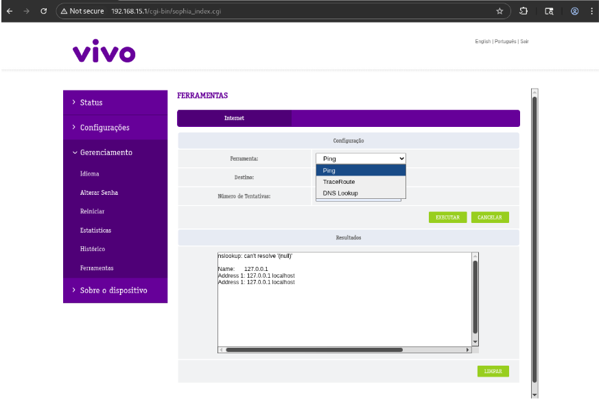
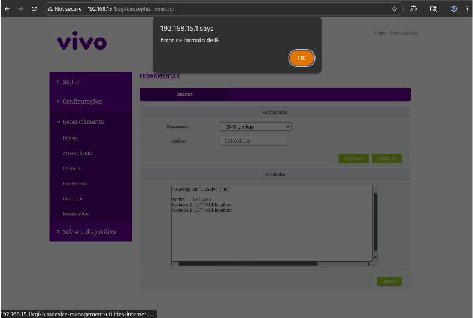
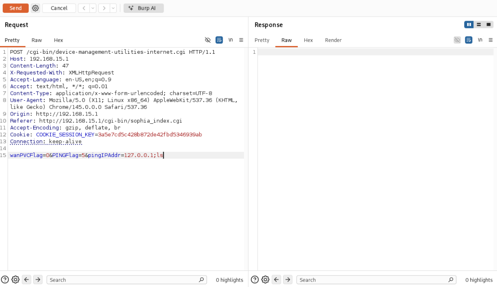
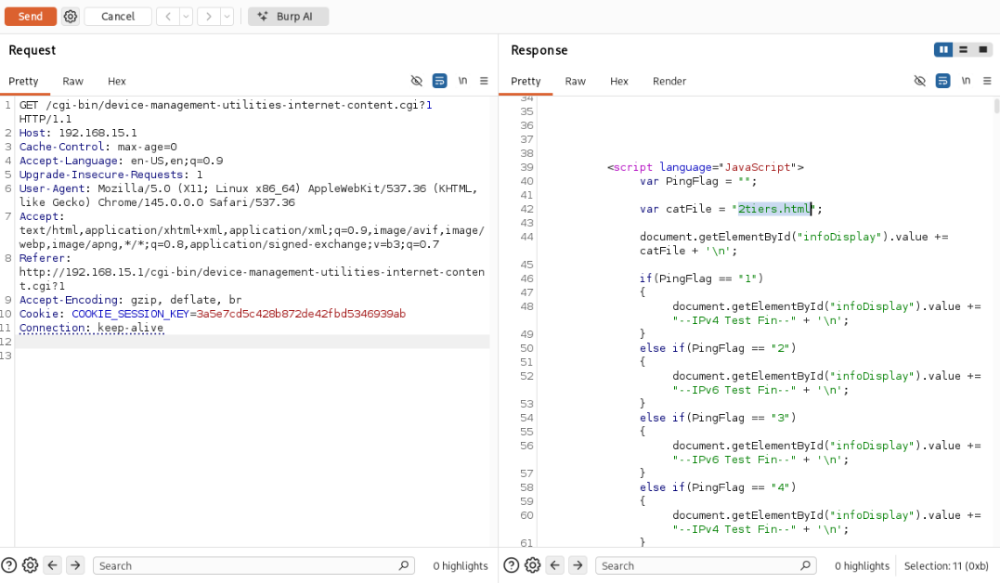
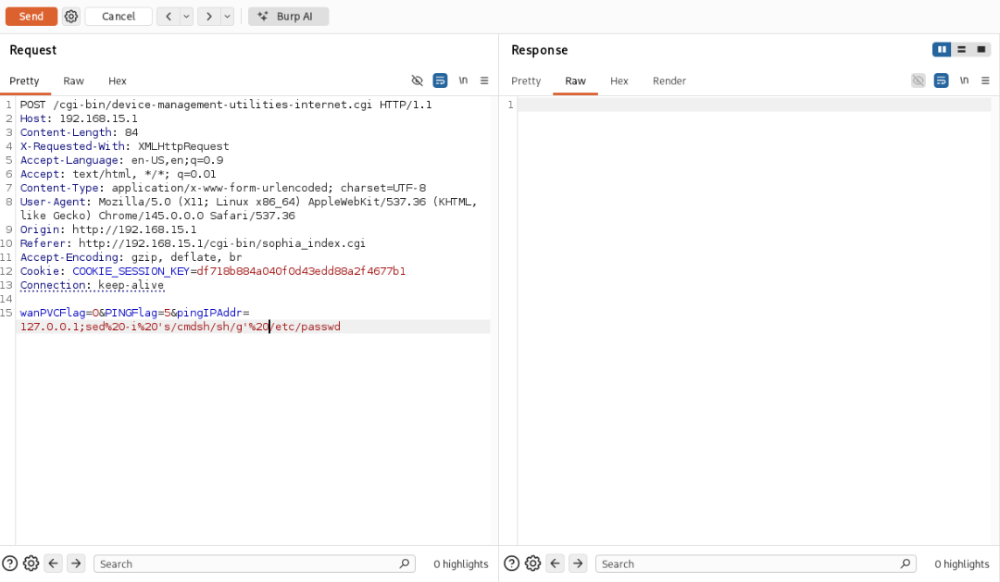
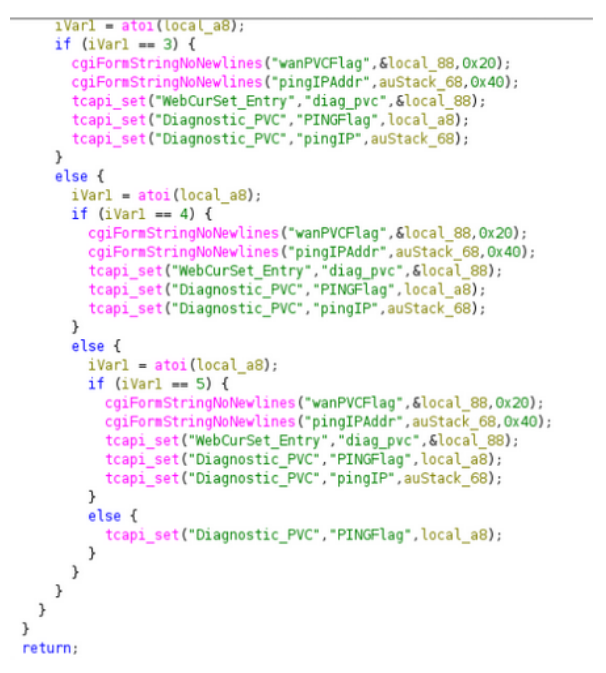

# CVE-2026-52483 - RCE authenticated via the VIVO administration portal utility

**Brand:** MitraStar

**Model:** GPT-2741GNAC-N2-SV

**Firmware:** BR_g8.10_1.11(WVK.0)b46

## Description
The ping diagnostic function implemented in the VIVO administration panel—along with
other functions within the "tools" section invoked via the
`/cgi-bin/device-management-utilities-internet.cgi` endpoint—allows for arbitrary code
execution on the operating system when concatenated using the `;` character. This same
vulnerability was previously reported in earlier firmware versions and assigned
CVE-2023-33381, involving a slight variation in the exploitation procedure.

## Impact
Leveraging the remote code execution vector in the router's operating system makes it
possible to read sensitive files and modify configuration files to obtain a shell, bypassing the
limitations imposed by the device's default settings.

## Proof of Concept
To reproduce the vulnerability, it is necessary to log in using the factory credentials specified
on the router's label. The exploitation point is located under the Management/Tools tab.

When attempting injection via the graphical interface, it is possible to observe some
sanitization regarding the IP format.

When constructed and sent via a proxy that allows packet data editing, the POST request
goes through without returning an error. Code execution consists of two steps. First, the
command concatenated with the IP address is sent to the
`/cgi-bin/device-management-utilities-internet.cgi` endpoint.

Next, by means of a GET request to the
`/cgi-bin/device-management-utilities-internet-content.cgi` endpoint—with an argument
specifying which function to call and the concatenated code (e.g., `ls`)—the command
results are obtained, and the listed files are displayed in the response body.

With this in mind, we can then write to the /etc/passwd file, creating a user with bash access
and root permissions.

## Root Cause

As observed in the decompiled `/cgi-bin/device-management-utilities-internet.cgi` CGI script,
the `cgiFormStringNewline` function accepts user input without any validation or checks for
malicious code injection. This indicates that IP format validation—which prevents injection
via the graphical interface—occurs only on the front-end. Consequently, any argument
injected into the endpoint via a text-based tool is embedded into the `local_88` variable and
executed by the operating system with the corresponding privileges.

## Mitigation suggestion
The issue can be resolved by implementing a backend user input validation mechanism
based on an allowlist of permitted characters, in accordance with OWASP best practices for
command injection protection. Additionally, it is recommended that system utilities be
invoked within the code using functions from the “execve()” family.
